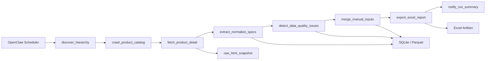

# 技术方案 v0.2 - 云端竞品参数抓取系统（OpenClaw）

## 1. 文档信息
- 版本：v0.2
- 日期：2026-04-18
- 对应 PRD：[PRD_v0.6_竞品参数抓取与整理.md](/Users/zhuyunchuan/Code/竞争分析/docs/PRD_v0.6_竞品参数抓取与整理.md)
- 当前阶段：Phase 1（仅抓取与整理，不做跨品牌对标）

## 2. 设计目标与边界
### 2.1 目标
1. 在云服务器通过 OpenClaw 定期执行抓取任务，不依赖本地电脑常开。
2. 动态发现 Hikvision 与 Dahua 的系列/子系列/型号。
3. 抽取最小字段集并标准化落库。
4. 输出固定结构 Excel，支持人工补录和修订回写。
5. 对数据质量异常进行标记和追踪。

### 2.2 边界
1. 不做 Hikvision 与 Dahua 的产品型号映射。
2. 不做大模型策略总结。
3. 不做前端系统，先以 Excel 和数据库为主要交付。

## 3. 总体架构


### 3.1 分层说明
1. 编排层：OpenClaw 负责 DAG、调度、重试、告警。
2. 采集层：站点适配器负责层级发现、列表抓取、详情抓取。
3. 解析层：字段提取器 + 归一化引擎。
4. 数据层：SQLite（结构化）+ Parquet（分析快照）+ 本地/对象存储（原始快照）。
5. 交付层：Excel 导出与运行摘要。

## 4. 技术选型
### 4.1 运行环境
1. Python 3.11
2. OpenClaw（已有云端实例）
3. SQLite 3（默认）+ Parquet（默认）
4. Docker + Docker Compose（建议）

### 4.2 关键库
1. 抓取：`httpx` + `playwright`（用于动态渲染页面）
2. 解析：`lxml` / `beautifulsoup4`
3. 数据处理：`pandas`
4. 存储访问：`sqlalchemy` + 内置 `sqlite3` + `pyarrow`（Parquet）
5. 分析引擎（可选）：`duckdb`
6. 导出：`openpyxl`（Excel）
7. 日志：`structlog` 或标准 `logging`（JSON 格式）

### 4.3 选型理由
1. Hikvision/Dahua 页面可能存在前端渲染，`playwright` 能提高稳定性。
2. `pandas + openpyxl` 可快速输出固定模板 Excel。
3. SQLite 运维成本低，适合当前规模和单机定时任务。
4. Parquet 适合保留批次快照，便于后续分析和审计。
5. 当并发写入和查询复杂度提升后，可无缝迁移到 PostgreSQL。

## 5. 模块设计
## 5.1 站点适配器（Source Adapter）
为每个品牌实现独立适配器，统一接口：
- `discover_series()`
- `discover_subseries(series_l1)`
- `list_products(series_l1, series_l2)`
- `fetch_product_detail(product_url)`

实现文件建议：
- `src/adapters/hikvision_adapter.py`
- `src/adapters/dahua_adapter.py`

## 5.2 层级发现模块
功能：
1. 发现 `series_l1` 和 `series_l2`。
2. 写入 `hierarchy_snapshot`。
3. 输出增量状态：`active` / `disappeared`。

策略：
1. 本期页面抓取为主。
2. 若页面结构突变，回退上期可用层级清单并告警。

## 5.3 产品目录模块
功能：
1. 按层级抓产品型号清单与详情页 URL。
2. 写入 `product_catalog`。
3. 维护 `first_seen_at`、`last_seen_at`。

去重键：
- `brand + series_l1 + series_l2 + product_model + locale`

## 5.4 参数抽取模块
功能：
1. 对详情页执行字段抽取。
2. 记录 `raw_value` 与 `normalized_value`。
3. 支持多值字段序列化（JSON 数组）。

最小字段集：
1. `image_sensor`
2. `max_resolution`
3. `lens_type`
4. `aperture`
5. `supplement_light_type`
6. `supplement_light_range`
7. `main_stream_max_fps_resolution`
8. `stream_count`
9. `interface_items`
10. `deep_learning_function_categories`
11. `approval_protection`
12. `approval_anti_corrosion_protection`

## 5.5 标准化模块
1. 字段名别名映射（中英、多 locale）。
2. 数值字段单位归一（如距离统一 `m`）。
3. 分辨率与 FPS 结构化拆解：
   - `fps_value`
   - `resolution_width`
   - `resolution_height`

## 5.6 异常检测模块
输出 `data_quality_issues`，规则：
1. `missing_field`
2. `parse_failed`
3. `unit_abnormal`
4. `duplicate_model`
5. `subseries_empty`
6. `hierarchy_changed`

严重级别建议：
1. P1：`parse_failed`（关键字段）
2. P2：`missing_field`、`duplicate_model`
3. P3：`unit_abnormal`、`hierarchy_changed`

## 5.7 人工补录与修订模块
输入来源：Excel `manual_append` sheet。

处理规则：
1. 人工值覆盖机器值，记录 `is_manual_override = true`。
2. 必填：`brand/series_l1/series_l2/product_model/field_code/manual_value/operator`。
3. 缺少层级信息的补录记录拒绝入库并报错。

## 5.8 Excel 导出模块
输出文件命名：
- `competitor_specs_<run_id>.xlsx`

固定 Sheet：
1. `hikvision_catalog`
2. `hikvision_specs`
3. `dahua_catalog`
4. `dahua_specs`
5. `manual_append`
6. `data_quality_issues`
7. `run_summary`

## 6. 数据模型（物理设计建议）
## 6.1 表与索引
1. `hierarchy_snapshot`
   - 索引：`(run_id, brand, series_l1, series_l2)`
2. `product_catalog`
   - 唯一索引：`(brand, series_l1, series_l2, product_model, locale)`
3. `product_specs_long`
   - 索引：`(run_id, brand, product_model, field_code)`
4. `manual_inputs`
   - 索引：`(brand, product_model, field_code, created_at)`
5. `data_quality_issues`
   - 索引：`(run_id, issue_type, severity, status)`
6. `run_summary`
   - 索引：`(started_at, schedule_type, status)`

## 6.2 历史快照策略
1. 每次任务生成 `run_id`（如 `20260418_biweekly_01`）。
2. 抓取结果按 `run_id` 分区逻辑存储，避免覆盖历史。
3. 支持按周期回溯参数变化。

## 6.3 轻量化存储策略
1. 在线数据：SQLite（单文件，事务写入）。
2. 批次快照：每次运行输出 Parquet（按 `run_id` 分目录）。
3. Excel 产物：按批次输出，供人工复核与分发。

## 6.4 升级到 PostgreSQL 的触发条件
满足以下任一条件时建议迁移：
1. 单日新增或更新记录量持续 > 10 万。
2. 需要多人并发写入或高频查询 API。
3. 需要复杂 SQL 分析且 SQLite 性能明显不足。
4. 需要更完善的权限隔离和高可用能力。

## 7. OpenClaw DAG 详细设计
## 7.1 DAG 节点
1. `discover_hierarchy`
2. `crawl_product_catalog`
3. `fetch_product_detail`
4. `extract_and_normalize_specs`
5. `detect_data_quality_issues`
6. `merge_manual_inputs`
7. `export_excel_report`
8. `notify_run_summary`

## 7.2 失败重试
1. 页面请求失败：重试 3 次，指数退避（2s/5s/10s）。
2. 单型号解析失败：记录失败并继续，不阻塞全局任务。
3. DAG 级失败：发送告警并保留中间产物。

## 7.3 并发与限速
1. 单站点并发建议 3-5。
2. 详情页抓取加随机抖动（300ms-1200ms）。
3. 配置 UA 与会话复用，避免触发频控。

## 8. 配置设计
建议维护 `config.yaml`：
```yaml
schedule:
  mode: biweekly   # biweekly or monthly
brands:
  hikvision:
    enabled: true
    entry_url: "https://www.hikvision.com/en/products/IP-Products/Network-Cameras/?category=Network+Products&subCategory=Network+Cameras&checkedSubSeries=null"
    series_l1_allowlist: ["Value", "Pro", "PT"]
  dahua:
    enabled: true
    entry_url: "https://www.dahuasecurity.com/products/network-products/network-cameras"
    series_keywords_allowlist: ["WizSense 2", "WizSense 3"]
crawler:
  concurrency: 4
  timeout_sec: 30
  retry_times: 3
storage:
  sqlite_path: "/data/db/competitor.db"
  parquet_dir: "/data/parquet"
  duckdb_path: "/data/db/analytics.duckdb"   # optional
  artifact_dir: "/data/artifacts"
  raw_snapshot_dir: "/data/raw_html"
```

## 9. 日志、监控与告警
## 9.1 日志字段
1. `run_id`
2. `task_name`
3. `brand`
4. `series_l1`
5. `series_l2`
6. `product_model`
7. `event`
8. `status`
9. `error_message`
10. `duration_ms`

## 9.2 指标
1. 目录抓取总数、详情抓取成功率。
2. 字段抽取成功率（按字段维度）。
3. 异常数（按类型/严重级别）。
4. 任务耗时（总耗时、各节点耗时）。

## 9.3 告警条件
1. 任务失败。
2. 抽取成功率低于 90%。
3. 本期子系列全部为空。
4. 关键字段 `parse_failed` 比例异常升高。

## 10. 合规与风控
1. 遵守网站条款与 `robots` 政策。
2. 控制请求频率与并发，不进行攻击性抓取。
3. 仅采集公开产品信息，不采集用户隐私数据。

## 11. 代码结构建议
```text
project/
  docs/
  src/
    adapters/
      hikvision_adapter.py
      dahua_adapter.py
    pipeline/
      discover_hierarchy.py
      crawl_catalog.py
      fetch_detail.py
      extract_specs.py
      normalize_specs.py
      detect_issues.py
      merge_manual.py
      export_excel.py
    core/
      config.py
      db.py
      models.py
      logging.py
      utils.py
    mappings/
      field_alias.yaml
      unit_rules.yaml
  tests/
    test_extract_hikvision.py
    test_extract_dahua.py
    test_normalize.py
  config.yaml
  requirements.txt
```

## 12. 测试方案
### 12.1 单元测试
1. 字段抽取器：给定固定 HTML，断言字段值正确。
2. 标准化规则：单位换算与字段映射断言。
3. 异常规则：输入样例后断言 issue 类型与严重级别。

### 12.2 集成测试
1. 小样本运行（每品牌 2 个子系列，每子系列 3 个型号）。
2. 验证 DAG 各节点产物和落库完整性。
3. 验证 Excel 模板列顺序稳定。

### 12.3 回归测试
1. 页面模板升级后跑历史样例集。
2. 关键字段抽取率与上次版本对比，不得显著下降。

## 13. 部署方案
## 13.1 云端部署步骤
1. 在云服务器创建项目目录并拉取代码。
2. 配置 Python 环境与依赖。
3. 准备 SQLite 数据文件目录和 Parquet 输出目录。
4. 在 OpenClaw 中注册 DAG 与调度。
5. 配置产物目录和告警通道。

## 13.2 运行模式
1. 双周任务：用于常规监控。
2. 月度任务：用于管理汇总。
3. 手动补跑：用于临时排障或修复后重抓。

## 14. 实施计划（3 周）
1. 第 1 周
   - 完成适配器与层级发现、目录抓取。
   - 建库建表与基础日志。
2. 第 2 周
   - 完成详情抓取、字段抽取、标准化。
   - 完成异常检测与人工补录回写。
3. 第 3 周
   - 完成 Excel 导出与 OpenClaw 编排。
   - 跑通双周任务并完成验收。

## 15. 后续扩展（Phase 2+）
1. 你提供对标关系后，新增 `product_mapping` 表和对比模块。
2. 新增跨品牌对比报告（字段差异与趋势）。
3. 接入大模型生成“竞品产品策略摘要”。
